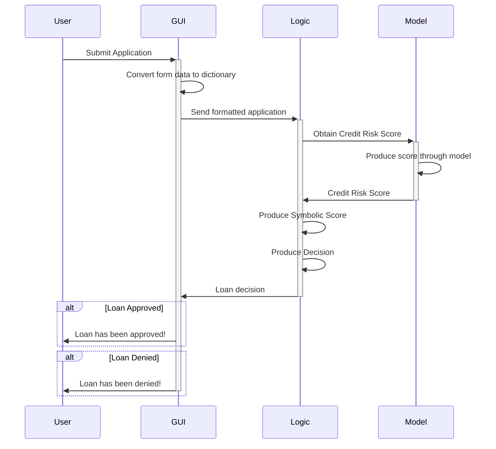

```mermaid

sequenceDiagram
    participant User
    participant GUI
    participant Logic
    participant Model

    User->>+GUI: Submit Application
    GUI->>GUI: Convert form data to dictionary
    GUI->>+Logic: Send formatted application
    Logic->>+Model: Obtain Credit Risk Score
    Model->>Model: Produce score through model

    Model->>-Logic: Credit Risk Score
    Logic->>Logic: Produce Symbolic Score
    Logic->>Logic: Produce Decision
    Logic->>-GUI: Loan decision

    alt Loan Approved
        GUI->>User: Loan has been approved!
    end

    alt Loan Denied
        GUI->>-User: Loan has been denied!
    end
```